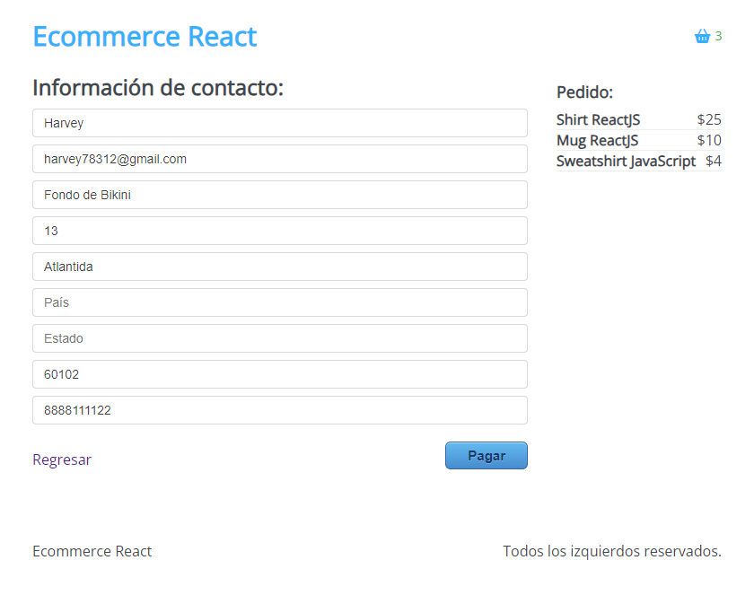

#  Ecommerce de ropa creado con ReactJS y API de Paypal v1.1.1
## Descripción del proyecto

Aplicación de tienda en linea para vender productos de programacion,
como ropa, sueters y demas cosas. Esta creado enteramente con ReactJS
consumiendo la API de Paypal.

## Funcionalidad

Esta radica en elegir los elementos que se quieren comprar, puesto que se
irán añadiendo al carrito para posteriomente hacer la compra mediante
tarjeta de debido o usando la app de paypal. Se pueden eliminar y añadir elementos,
ademas de adjuntar la dirección de envio de los productos.

## Imagenes

Vista principal del proyecto

Vista de los productos añadidos al carrito

Vista de formulario de datos personales para el envió

Vista de métodos de pago (API Paypal)

Pago procesado mediante paypal (al iniciar sesión se muestran los montos respectivos)

Pago procesado con tarjeta de débido o crédito

## Cambios

- En la versión anterior se generaba un problema con los links de los productos, se
solucionó en la versión 1.1.1.

- Se añadieron al proyecto las imagenes, solo son con fines ilustrativos.